# Hackackathon

Un proyecto hecho con Django para la gestión de hackackatones.

## Instrucciones

### Para desarrollo

Después de clonar el repositorio, sigue estos pasos para iniciar el desarrollo:

1. Definir variables de entorno.\
   Renombra `plantilla.env` a `.env` y fija los valores de las variables.
1. Crear el entorno virtual de Python e instalar las dependencias (`requirements.txt`).
1. Crear la base de datos con las migraciones existentes:\
   `python manage.py migrate`
1. Cargar la tabla de restricciones alimentarias:\
   `python manage.py loadddata restriccion_alimentaria`
1. Crea un superusuario:\
   `python manage.py createsuperuser` (puedes dejar el correo en blanco)
1. Crea los grupos base y asigna los permisos:\
   `python manage.py crear_permisos_grupos`
1. (Opcional) Generar Participantes de ejemplo:\
   `python manage.py fakeuserdata <cantidad>`
1. Iniciar el desarrollo

Si no tienes experiencia con Django tienes info de cómo iniciar el servidor de desarrollo
[aquí](https://docs.djangoproject.com/en/5.2/intro/tutorial01/#the-development-server)
y sobre Django en general [aquí](https://www.djangoproject.com/start/).

### Para despliegue

Desplegado sobre Debian 13:

1. Usar usuario `debian`.
1. Definir variables de entorno.\
   Renombra `plantilla.env` a `.env` y fija los valores de las variables.
1. Instalar las dependencias (`requirements.txt`).
1. Crear la base de datos con las migraciones existentes:\
   `python manage.py migrate`
1. Cargar la tabla de restricciones alimentarias:\
   `python manage.py loadddata restriccion_alimentaria`
1. Crea un superusuario:\
   `python manage.py createsuperuser` (puedes dejar el correo en blanco)
1. Crea los grupos base y asigna los permisos:\
   `python manage.py crear_permisos_grupos`
1. Configurar nginx:\
   `sudo cp ./doc/nginx-default /etc/nginx/sites-available/default`
1. Lanzar gunicorn con la configuración especificada:\
   `gunicorn`

Para el despliegue automático después de un reinicio del servidor está disponible
el crontab en el archivo `doc/crontab`.

También se incluye el archivo `doc/backup.sh`, que crea una copia de la base de datos.\
Como la base de datos está en [modo WAL](https://sqlite.org/wal.html),
en el crontab se fuerza un checkpoint antes de las copias de seguridad.

Tanto para el `crontab` como para `backup.sh` será necesario definir o reemplazar
`$ruta` con la ruta al directorio donde se clonó el repositorio.

## Proceso de los participantes

Los distintos estados en los que una persona puede encontrarse son:

1. **Registrada**\
   La persona ha cubierto el formulario de registro.
2. (*Opcionalmente*) **Con error en el envío del correo de verificación**\
   Ha habido un problema al enviar el correo y se requiere intervención manual.
3. **Verificada**\
   La persona tiene el correo verificado.
4. **Aceptada**\
   A la persona se le ha aceptado en el evento.
5. **Confirmada**\
   La persona ha aceptado la plaza que se le ofreció.
6. (*Opcionalmente*) **Rechazada**\
   La persona ha rechazado la plaza que se le ofreció.

Los estados están detallados en el orden habitual en el que ocurren.\
Una persona puede rechazar su plaza después de haberla aceptado,
pero no la puede aceptar (sin intervención manual de administración)
después de haberla rechazado.

## Diagrama Entidad-Relación de los modelos

```mermaid
erDiagram

    %% No almacenado en BD.
    PERSONAABSTRACTA {
        string correo PK
        string nombre
        text notas
        string acreditacion
        text detalle_restricciones_alimentarias
    }

    PATROCINADOR {
        string correo PK, FK
        string empresa
    }

    PERSONA {
        string correo PK, FK
        string dni
        string genero
        string talla_camiseta
        file cv
        bool compartir_cv
        datetime fecha_registro
        datetime fecha_verificacion_correo
        datetime fecha_aceptacion
        datetime fecha_confirmacion_plaza
        datetime fecha_rechazo_plaza
        text motivo_error_correo_verificacion
    }

    MENTOR {
        string correo PK, FK
        string telefono
        date fecha_nacimiento
        string ciudad
        bool quiere_creditos
        text motivacion
    }

    PARTICIPANTE {
        string correo PK, FK
        string telefono
        date fecha_nacimiento
        string nivel_estudio
        string nombre_estudio
        string centro_estudio
        string curso
        string ciudad
        bool quiere_creditos
        text motivacion
    }

    RESTRICCIONALIMENTARIA {
        int id_restriccion PK
        string nombre
    }

    PRESENCIA {
        int id_presencia PK
        string persona_id FK
        datetime entrada
        datetime salida
    }

    TIPOPASE {
        int id_tipo_pase PK
        string nombre
        datetime inicio_validez
    }

    PASE {
        int id_pase PK
        string persona_id FK
        int tipo_pase_id FK
        datetime fecha
    }

    TOKEN {
        uuid token PK
        string tipo
        string persona_id FK
        datetime fecha_creacion
        datetime fecha_expiracion
        datetime fecha_uso
    }

    %% Relaciones
    PERSONAABSTRACTA ||--o{ RESTRICCIONALIMENTARIA : ""
    PERSONA ||--o{ PRESENCIA : ""
    PERSONA ||--o{ PASE : ""
    PERSONA ||--o{ TOKEN : ""

    TIPOPASE ||--o{ PASE : ""

    %% Herencia
    PERSONAABSTRACTA ||--|{ PATROCINADOR : ""
    PERSONAABSTRACTA ||--|{ PERSONA : ""
    PERSONA ||--|{ PARTICIPANTE : ""
    PERSONA ||--|{ MENTOR : ""
```

## Licencia

El proyecto está bajo la licencia AGPLv3, para más info ver [la licencia](LICENSE).
