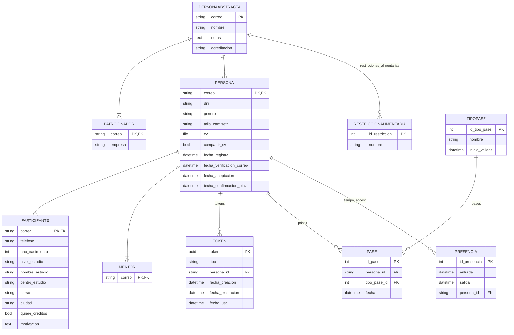

# Hackackathon

Un proyecto hecho con Django para la gestión de hackackatones.

# Diagrama Entidad-Relación de los modelos empleados

## Licencia

El proyecto está bajo la licencia AGPLv3, para más info ver [la licencia](LICENSE).
