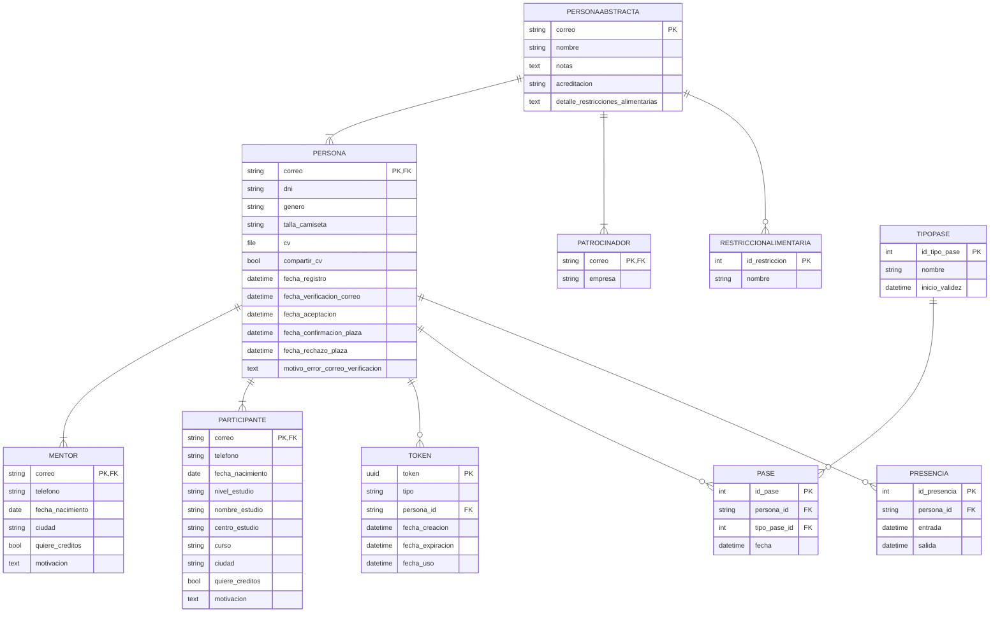

# Hackackathon

Un proyecto hecho con Django para la gestión de hackackatones.

## Instrucciones para desarrollo

Después de clonar el repositorio, sigue estos pasos para iniciar el desarrollo:

1. Definir variables de entorno.\
   Renombra `plantilla.env` a `.env` y fija los valores de las variables.
1. Crear el entorno virtual de Python e instalar las dependencias (`requirements.txt`).
1. Crear la base de datos con las migraciones existentes:\
   `python manage.py migrate`
1. Cargar la tabla de restricciones alimentarias:\
   `python manage.py loadddata restriccion_alimentaria`
1. Crea un superusuario:\
   `python manage.py createsuperuser` (puedes dejar el correo en blanco)
1. Crea los grupos base y asigna los permisos:\
   `python manage.py crear_permisos_grupos`
1. (Opcional) Generar Participantes de ejemplo:\
   `python manage.py fakeuserdata <cantidad>`

## Diagrama Entidad-Relación de los modelos

## Licencia

El proyecto está bajo la licencia AGPLv3, para más info ver [la licencia](LICENSE).
