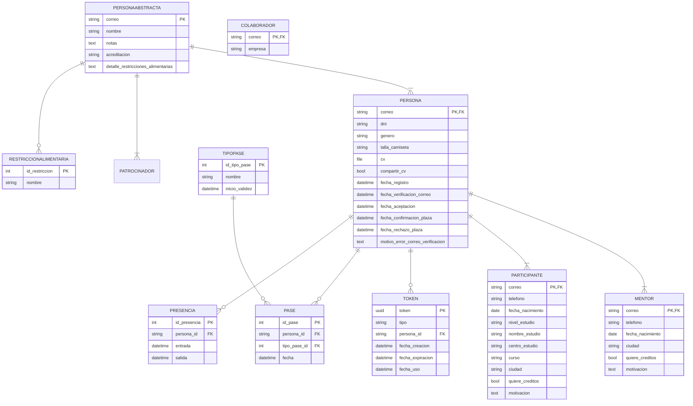

# Modelos en base de datos

## Diagrama Entidad-Relación de los modelos

No es un diagrama completamente fiel al estándar pero está pensado como guía
general del planteamiento de los modelos.

```mermaid
erDiagram

    %% No almacenado en BD.
    PERSONAABSTRACTA {
        string correo PK
        string nombre
        text notas
        string acreditacion
        text detalle_restricciones_alimentarias
    }

    COLABORADOR {
        string correo PK, FK
        string empresa
    }

    PERSONA {
        string correo PK, FK
        string dni
        string genero
        string talla_camiseta
        file cv
        bool compartir_cv
        datetime fecha_registro
        datetime fecha_verificacion_correo
        datetime fecha_aceptacion
        datetime fecha_confirmacion_plaza
        datetime fecha_rechazo_plaza
        text motivo_error_correo_verificacion
    }

    MENTOR {
        string correo PK, FK
        string telefono
        date fecha_nacimiento
        string ciudad
        bool quiere_creditos
        text motivacion
    }

    PARTICIPANTE {
        string correo PK, FK
        string telefono
        date fecha_nacimiento
        string nivel_estudio
        string nombre_estudio
        string centro_estudio
        string curso
        string ciudad
        bool quiere_creditos
        text motivacion
    }

    RESTRICCIONALIMENTARIA {
        int id_restriccion PK
        string nombre
    }

    PRESENCIA {
        int id_presencia PK
        string persona_id FK
        datetime entrada
        datetime salida
    }

    TIPOPASE {
        int id_tipo_pase PK
        string nombre
        datetime inicio_validez
    }

    PASE {
        int id_pase PK
        string persona_id FK
        int tipo_pase_id FK
        datetime fecha
    }

    TOKEN {
        uuid token PK
        string tipo
        string persona_id FK
        datetime fecha_creacion
        datetime fecha_expiracion
        datetime fecha_uso
    }

    %% Relaciones
    PERSONAABSTRACTA ||--o{ RESTRICCIONALIMENTARIA : ""
    PERSONA ||--o{ PRESENCIA : ""
    PERSONA ||--o{ PASE : ""
    PERSONA ||--o{ TOKEN : ""

    TIPOPASE ||--o{ PASE : ""

    %% Herencia
    PERSONAABSTRACTA ||--|{ PATROCINADOR : ""
    PERSONAABSTRACTA ||--|{ PERSONA : ""
    PERSONA ||--|{ PARTICIPANTE : ""
    PERSONA ||--|{ MENTOR : ""
```
